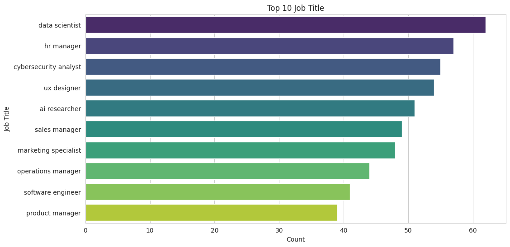
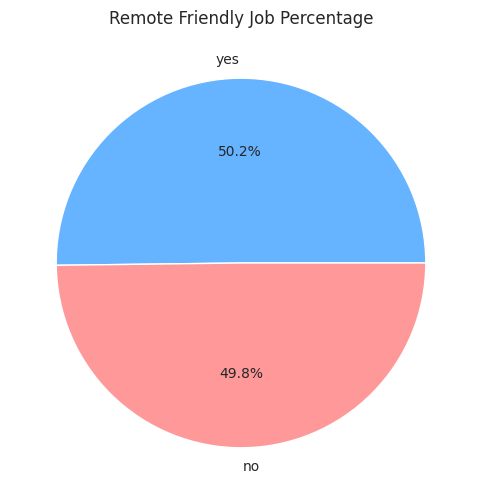
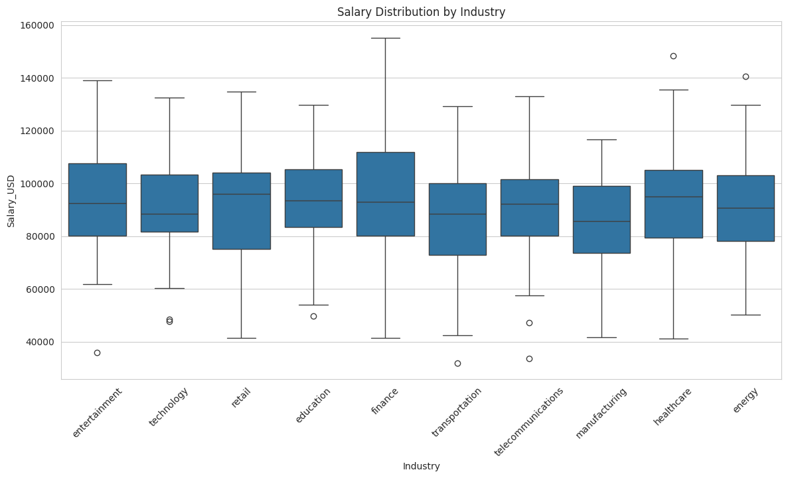
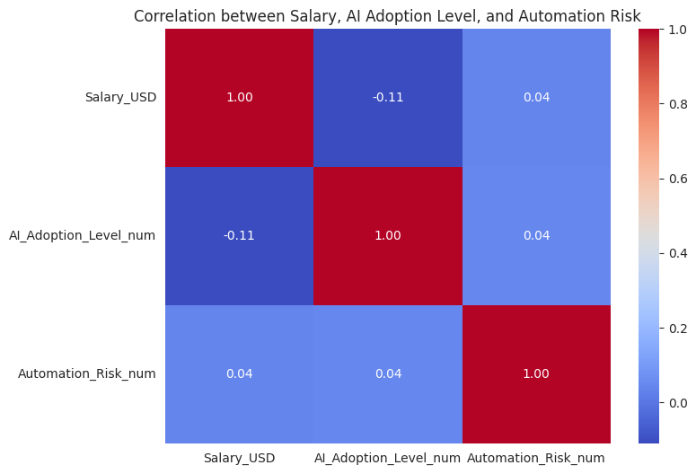

Job Market Analytics Using Python

This is a personal project analyzing a dataset of global job market trends, focusing on AI adoption, automation risk, required skills, salary distribution, and remote work potential. The project aims to develop skills in data analysis, visualization, and business intelligence using Python.

 Dataset :
- File: `ai_job_market_insights.csv`
- Contains job-related data including:
  - Job title
  - Industry
  - Company size
  - Location
  - AI adoption level
  - Automation risk
  - Required skills
  - Salary (USD)
  - Remote-friendly indicator
  - Growth projections

Tools & Libraries Used :
- Python
- Pandas
- Seaborn & Matplotlib (visualization)
- Folium (geospatial visualization)
- Git & GitHub

 Key Analyses :
- Top 10 most common job titles and industries
- Salary distribution by industry
- Skill-based salary insights (Python, JavaScript, ML)
- Remote job percentages
- Geographical distribution of jobs
- Correlation between salary, AI adoption, and automation risk

  Sample Visuals:

 How to Run : 
1. Clone this repository:
  bash
    git clone <repository_url>
  
2. Install the required libraries:
   bash
    pip install pandas seaborn matplotlib folium
 
3. Run the Python script:
   bash
    python data_analysis_project_using_python_and_data_analytics.py
   

Alaa Al-Qudah
Artificial Intelligence & Robotics Student
